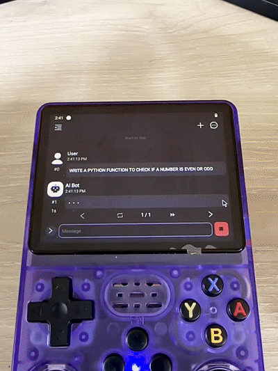

# Running AI locally on R36S gaming console

## Support me:

[![]

## [GitMission](https://www.gitmission.com/)
Stop watching tutorials. Start solving real-world engineering problems with your virtual engineering team in a fully interactive browser environment. Visit [GitMission](https://www.gitmission.com/) to learn more.

### Softwares: 
- [LineageOS](https://github.com/andr36oid/releases/releases)
- [Balena Etcher](https://etcher.balena.io/)
- [ChatterUI](Chatter.apk)

### AI Modeles:
- [SmolLM2-135M-Instruct.Q4_0.gguf](https://huggingface.co/QuantFactory/SmolLM2-135M-Instruct-GGUF/blob/main/SmolLM2-135M-Instruct.Q4_0.gguf)
- [SmolLM2-360M-Instruct-Q4_0.gguf](https://huggingface.co/bartowski/SmolLM2-360M-Instruct-GGUF/blob/main/SmolLM2-360M-Instruct-Q4_0.gguf)
- [qwen2.5-0.5b-instruct-q4_0.gguf](https://huggingface.co/Qwen/Qwen2.5-0.5B-Instruct-GGUF/blob/main/qwen2.5-0.5b-instruct-q4_k_m.gguf)
- [qwen2.5-coder-0.5b-instruct-q8_0.gguf](https://huggingface.co/Qwen/Qwen2.5-Coder-0.5B-Instruct-GGUF/blob/main/qwen2.5-coder-0.5b-instruct-q8_0.gguf)

